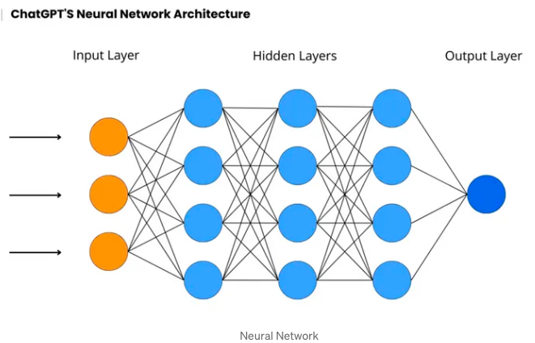

# Chapter 1: Teaching Machines to See — The Fundamentals of Computer Vision

## Introduction to Vision as a Human and Machine Capability

Vision is arguably one of the most powerful and complex senses possessed by biological organisms. It’s our primary means of understanding the physical world: detecting emotion in a face, navigating through a crowded street, reading a traffic light — all happen almost instantaneously and often subconsciously. But what if we could endow machines with the same perceptual ability?

This chapter explores how we can program machines — especially deep learning models — to perceive and interpret the world visually. In other words, we're aiming to replicate the capability of sight in computers using raw image inputs.

---

## What is Vision, Conceptually?

At its most essential definition, **vision is the ability to determine "what is where by looking."** But this deceptively simple idea hides immense complexity. Consider how much context you subconsciously interpret when looking at a single image:

- What objects are present?
- Where are they located?
- Are they moving or stationary?
- What are their relationships to each other?
- What might happen next?

This act of perception isn’t just about labeling pixels — it involves **spatial reasoning**, **temporal inference**, and even **predictive modeling**.

---

## Static vs. Dynamic Perception

Human vision doesn’t just recognize objects statically; it understands them **dynamically**. For instance, consider an urban street scene:

- A white van parked on the left side of the road is understood to be **static**.
- A sedan in motion in the same frame is interpreted **differently** — even though both are visually "cars."
- Pedestrians on the sidewalk versus those crossing the street are perceived in terms of **action and intention**.
- A red traffic light implies **upcoming behavior** from moving vehicles.

This is critical: vision is not just about detecting what is in the image — it's also about **understanding how things interact over time**.

Human vision inherently reasons about **temporality**, **intent**, and **dynamics**, and our goal is to instill a similar **representational** and **inferential** power in computer vision systems.

---

## Why Computer Vision Matters

Computer vision powers real-world applications such as:

- **Autonomous driving**: detecting lane boundaries, pedestrians, traffic signs.
- **Medical image analysis**: identifying tumors from scans.
- **Augmented reality and robotics**: spatial mapping, scene understanding.
- **Industrial automation**: defect detection in manufacturing.

These systems must do more than **classify** — they must **perceive the scene**, **predict changes**, and **react accordingly**, all in **real-time**.

 
