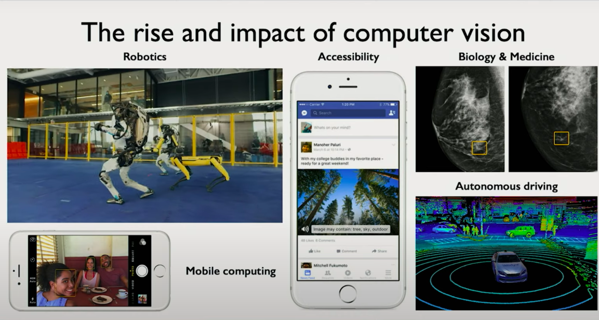
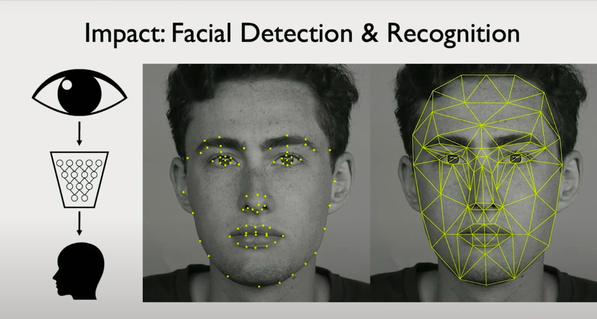
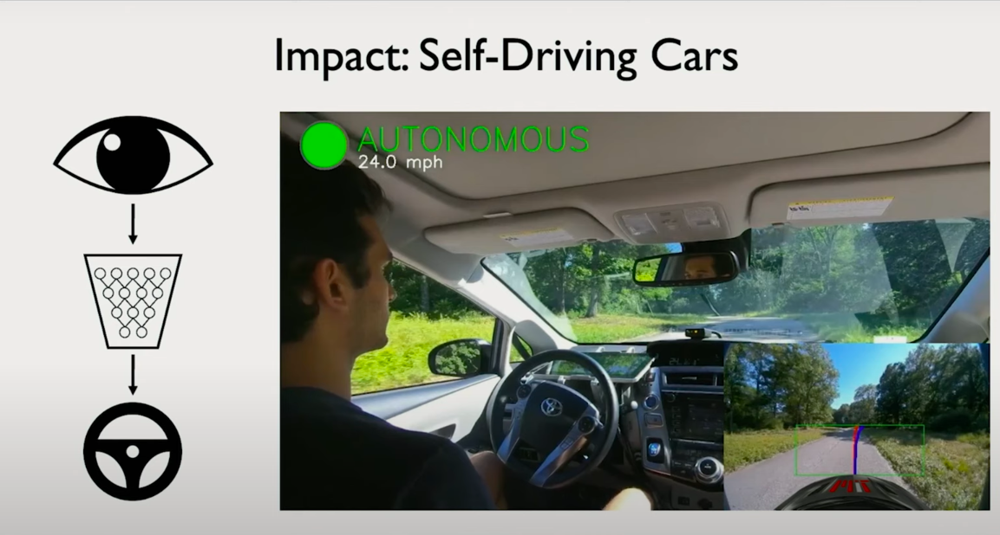
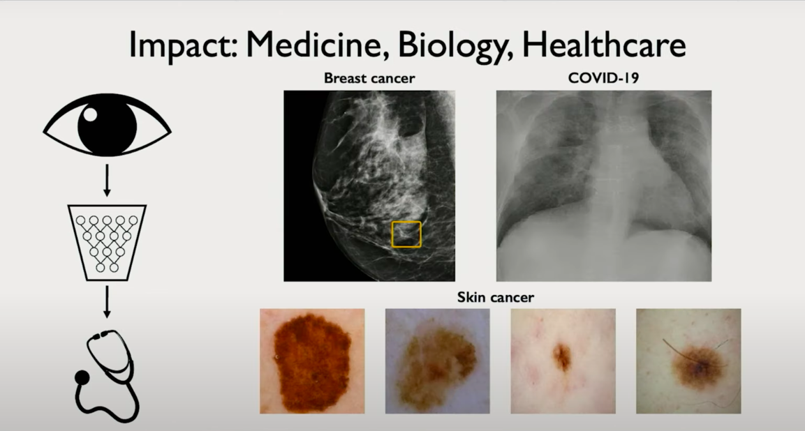
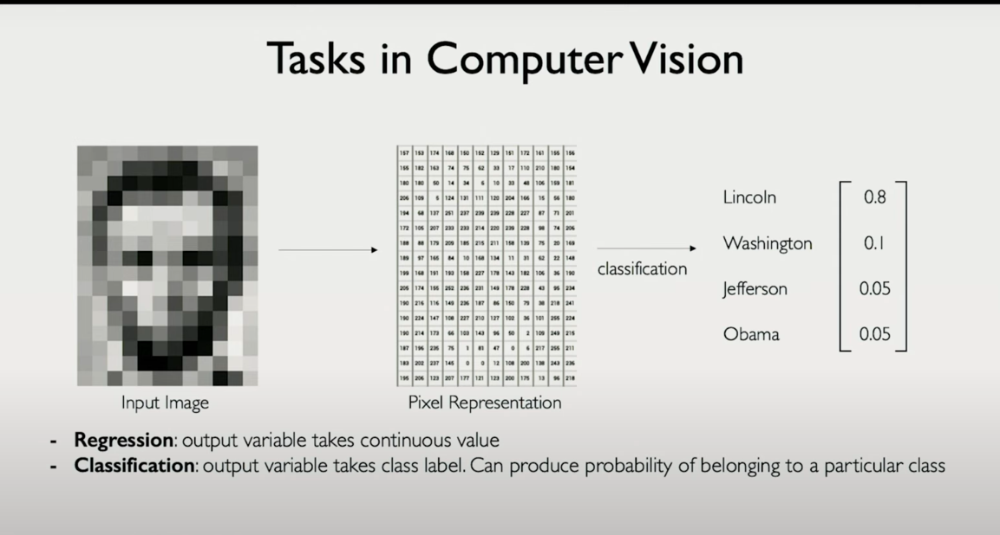

# Chapter 1: Teaching Machines to See — The Fundamentals of Computer Vision

## Introduction to Vision as a Human and Machine Capability

Vision is arguably one of the most powerful and complex senses possessed by biological organisms. It’s our primary means of understanding the physical world: detecting emotion in a face, navigating through a crowded street, reading a traffic light — all happen almost instantaneously and often subconsciously. But what if we could endow machines with the same perceptual ability?

This chapter explores how we can program machines — especially deep learning models — to perceive and interpret the world visually. In other words, we're aiming to replicate the capability of sight in computers using raw image inputs.

---

## What is Vision, Conceptually?

At its most essential definition, **vision is the ability to determine "what is where by looking."** But this deceptively simple idea hides immense complexity. Consider how much context you subconsciously interpret when looking at a single image:

- What objects are present?
- Where are they located?
- Are they moving or stationary?
- What are their relationships to each other?
- What might happen next?

This act of perception isn’t just about labeling pixels — it involves **spatial reasoning**, **temporal inference**, and even **predictive modeling**.

---

## Static vs. Dynamic Perception

Human vision doesn’t just recognize objects statically; it understands them **dynamically**. For instance, consider an urban street scene:

- A white van parked on the left side of the road is understood to be **static**.
- A sedan in motion in the same frame is interpreted **differently** — even though both are visually "cars."
- Pedestrians on the sidewalk versus those crossing the street are perceived in terms of **action and intention**.
- A red traffic light implies **upcoming behavior** from moving vehicles.

This is critical: vision is not just about detecting what is in the image — it's also about **understanding how things interact over time**.

Human vision inherently reasons about **temporality**, **intent**, and **dynamics**, and our goal is to instill a similar **representational** and **inferential** power in computer vision systems.

---

## Why Computer Vision Matters

Computer vision powers real-world applications such as:

- **Autonomous driving**: detecting lane boundaries, pedestrians, traffic signs.
- **Medical image analysis**: identifying tumors from scans.
- **Augmented reality and robotics**: spatial mapping, scene understanding.
- **Industrial automation**: defect detection in manufacturing.

These systems must do more than **classify** — they must **perceive the scene**, **predict changes**, and **react accordingly**, all in **real-time**.

 
# Chapter 2: Deep Learning's Transformative Role in Computer Vision

## The Deep Learning Revolution in Visual Understanding

In the past decade, deep learning has transformed the landscape of computer vision. What was once a field defined by handcrafted features, pipelines of rule-based heuristics, and brittle performance is now dominated by end-to-end models that learn directly from raw pixels.

This shift is not just an incremental improvement. It is a foundational rethinking of how machines perceive and interpret visual information. Deep neural networks have become the primary engine for visual perception tasks across industries and platforms, from large-scale robotics systems to compact mobile devices.

## Real-World Applications: From Cloud to Edge

Computer vision is no longer confined to research labs or high-end servers. Today, it runs in your pocket.

Modern smartphones ship with multiple vision models embedded in their hardware. These models power tasks such as real-time face recognition for authentication, scene segmentation for photo enhancement, and even depth estimation to support augmented reality.

Embedded vision is also key to autonomous drones, smart glasses, and wearables. These edge devices operate with strict latency and power constraints, yet they perform complex visual inference tasks. The deep learning models they use are highly optimized, often quantized, and sometimes trained using transfer learning from larger models.

## Vision in Healthcare and Biology

In healthcare and biology, deep learning offers capabilities that rival expert-level human performance.

Computer vision systems now analyze medical images such as X-rays, MRIs, and pathology slides to detect anomalies, classify tissue types, and even estimate disease progression. Importantly, they can detect subtle features that are often overlooked by human observers, and they do so with consistency and speed.

For instance, retinal imaging models assist ophthalmologists in diagnosing diabetic retinopathy. In radiology, convolutional networks help prioritize scans with potential tumors for urgent review. These tools are reshaping diagnostic workflows and expanding access to expert-grade medical analysis.

## Self-Driving Cars: A Grand Challenge for Vision

Autonomous driving represents one of the most complex and high-stakes applications of computer vision.

One of the hallmark projects in this domain was developed at MIT. Unlike the traditional approach of building a pipeline of modular subsystems—one for perception, one for planning, another for control—this project involved building an end-to-end model. The model learned to drive directly from raw visual input without relying on predefined maps.

The input to the model was the raw image stream from front-facing cameras. The output was driving commands. This method is elegant but challenging, as it requires the model to implicitly learn navigation, obstacle avoidance, traffic rule compliance, and more, just from visual input.

What made this project significant was that the system could generalize to unseen roads. It did not need prior knowledge of the environment. This points toward a future where vision-based autonomy might not require detailed HD maps or handcrafted priors.

## Classical to Contemporary: Facial Recognition as a Case Study

One of the earliest and most impactful applications of computer vision was facial detection. Initially, the goal was simple: detect whether or not a face is present in an image.

With deep learning, this problem has evolved dramatically. Modern models not only detect faces but also extract nuanced features such as facial landmarks, gaze direction, and micro-expressions. These features allow systems to estimate emotional state, detect identity under occlusion, and even track attention in real-time.

# Chapter 3: From Pixels to Perception — How Computers Interpret Images

## Bridging Human Intuition and Machine Perception

In today’s class, we begin to transition from high-level applications to the underlying mechanics that enable them. The central question is both philosophical and technical: **how can we take a task that humans perform effortlessly and encode that capability into machines?**

For example, recognizing a face, distinguishing between two objects, or interpreting a scene are actions we perform with no conscious thought. Yet each of these tasks requires a series of complex perceptual computations.

> The goal is to design models that can perform such tasks with the same level of efficiency and accuracy, despite the lack of human intuition.

---

## How Computers Represent Images

At the lowest level, images are fundamentally numerical. While to us an image of Abraham Lincoln is a coherent visual entity, to a computer it is nothing more than a structured set of values.

- In **grayscale images**, each pixel is represented by a single intensity value.
- In **color images**, each pixel is represented by a triplet of numbers corresponding to **red**, **green**, and **blue** intensities.

This leads to two primary types of image representations:

- **Grayscale Image**: Represented as a 2D matrix of shape `(height, width)`
- **Color Image**: Represented as a 3D tensor of shape `(height, width, 3)`

This structured representation is ideal for feeding into neural networks. Unlike text, which must be tokenized and embedded, images are already in a **dense numerical format**. The challenge is not converting them into numbers, but **interpreting** the numbers meaningfully.

---

## Understanding the Learning Tasks: Regression and Classification

Once an image is represented numerically, we can train deep learning models to perform specific tasks. These tasks typically fall into two broad categories:

### Regression

- **Outputs** continuous values.
- **Examples in vision**:
  - Predicting the age of a person from a face image
  - Estimating the depth of each pixel in a scene
  - Forecasting motion vectors

### Classification

- **Outputs** discrete class labels.
- **Example**: Given an image of a historical figure, determine whether it is Abraham Lincoln, George Washington, or another U.S. president.
- The output is one of **K** possible categories, and the model must learn to assign high probability to the correct one.

> The classification task is central to many computer vision problems. For a model to classify images correctly, it must first learn to identify the features that distinguish one class from another.

---

## Feature Extraction: The Key to Recognition

Let’s ground this with an example: identifying whether a portrait is Abraham Lincoln or George Washington. Humans rely on distinctive features such as:

- Facial structure  
- Hairstyle  
- Beard or lack thereof  
- Historical clothing artifacts

For a machine to do this, it must also extract features — but unlike humans, it needs these features to be either **explicitly defined** or **automatically learned**.

This brings us to the heart of deep learning for vision: **representation learning**.

Neural networks learn to extract features from raw pixels through successive layers of:

- **Convolution**
- **Pooling**
- **Non-linear transformation**

- Lower layers capture **local edges and textures**.
- Deeper layers capture **higher-level abstractions** such as facial parts or spatial arrangements.

By learning a hierarchy of features, the network becomes capable of associating specific patterns with specific labels.

---

## Summary

In this chapter, we have laid the foundation for understanding how deep learning systems interpret images. The pipeline begins with raw pixel arrays and flows into two core types of learning problems: **regression** and **classification**.

### Key insights:

- Images are **structured arrays of numbers**, inherently suitable for machine interpretation.
- Classification tasks require models to **detect and leverage features** that separate one class from another.
- Deep networks automate this **feature extraction** through layers of learned filters, enabling models to understand visual patterns with increasing abstraction.

