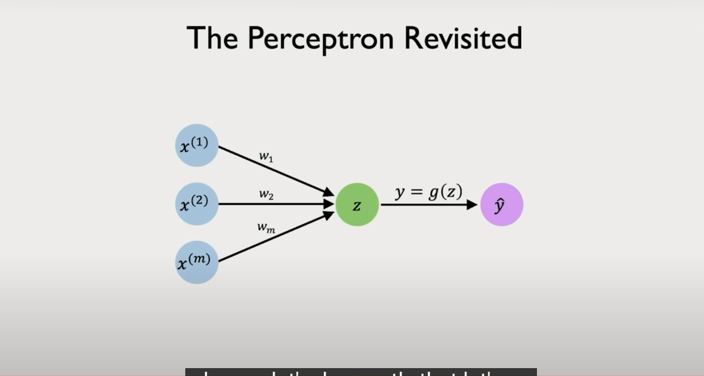
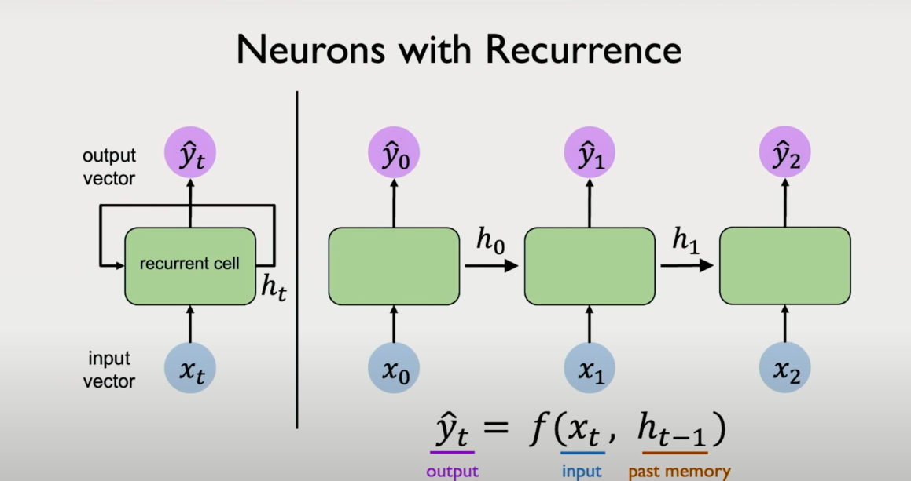
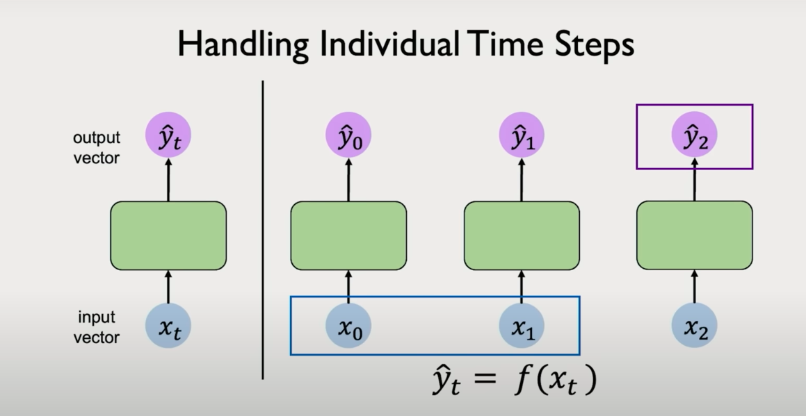
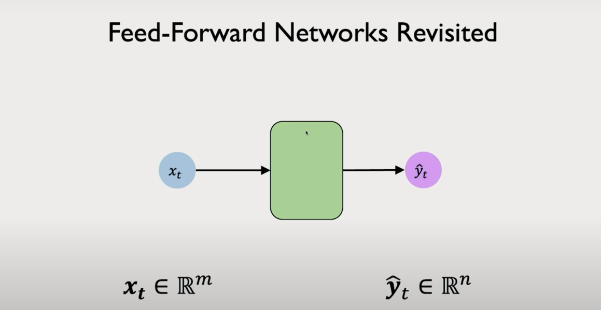
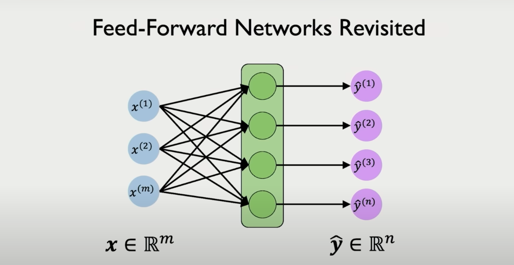

# Chapter 1: Foundations of Deep Sequence Modeling

## Why Sequence Modeling? A Motivating Example

Let’s begin with an intuitive motivation. Imagine a ball moving in 2D space. You're asked to predict its next location.  
**Case 1:**  
You only have access to the ball's current position. Any prediction you make will essentially be a guess — the problem is underdetermined.

**Case 2:**  
You're also given the ball’s prior trajectory — its historical positions. With this sequence of past states, you can now model its motion and reasonably estimate its future position.

This illustrates the crux of sequence modeling: incorporating historical context to improve predictive accuracy.

## Sequence Data in the Real World

While the example above is simple, the relevance of sequence modeling extends across diverse domains:

- **Speech and Audio:**  
  Voice signals can be decomposed into sequences of sound wave chunks over time.

- **Natural Language:**  
  Sentences are sequences of words or characters.

- **Medical Signals:**  
  ECGs and EEGs are temporal sequences of voltage measurements.

- **Finance:**  
  Stock prices and market indicators evolve as time-series data.

- **Biology:**  
  DNA and protein sequences are naturally sequential.

- **Video:**  
  Frame-by-frame temporal evolution can be modeled as sequences.

- **Weather Forecasting:**  
  Historical weather patterns provide sequential structure for future prediction.

In each case, the temporal or positional ordering of data points is essential. Ignoring that order risks discarding key patterns.

## Types of Sequence Modeling Problems

Unlike traditional classification tasks where inputs and outputs are fixed-length and often tabular, sequence modeling introduces structured and variable-length data. Let's look at some canonical problem types:

### Sequence Classification:
- **Input:** A sequence of tokens (e.g., words in a sentence)  
- **Output:** A fixed label (e.g., sentiment classification: positive vs negative)  
- **Example:** Text classification, intent recognition.

### Sequence-to-Sequence (Seq2Seq) Generation:
- **Input:** A sequence  
- **Output:** Another sequence  
- **Examples:**  
  - Translation: English → French  
  - Speech Recognition: Audio → Text  
  - Image Captioning: Visual features → Sentence

### Many-to-One:
- **Input:** A sequence  
- **Output:** A single label  
- **Example:** Predicting stock trend direction based on previous N time steps.

### One-to-Many:
- **Input:** A single state  
- **Output:** A sequence  
- **Example:** Image → Description (caption generation).

### Many-to-Many:
- **Input:** Sequence A  
- **Output:** Sequence B  
- **Example:**  
  - Video frame → Text transcript  
  - Language translation tasks

These problem types are foundational to real-world applications of NLP, speech, vision, and decision modeling systems.

## Core Challenge: Capturing Temporal Dependencies

A feedforward neural network  as discussed in the previous lecture  assumes that all input features are independent and identically distributed (i.i.d.). This assumption breaks down in sequential settings. In sequence modeling:

- Inputs are ordered.  
- Future predictions must respect and leverage past observations.  
- The same model must be applied across time steps or positions.

To handle this, we need architectures that are designed to process sequences  capable of learning representations where current predictions are functions of both present and past information.

This sets the stage for understanding Recurrent Neural Networks (RNNs), Long Short-Term Memory (LSTM) networks, and eventually, Transformers.

# Chapter :2 2.7 From Static Networks to Time-Aware Models

In the previous section, we established the importance of modeling sequential dependencies. We now turn to how the field historically addressed this problem, beginning with a shift from traditional feedforward architectures to networks capable of handling temporal dynamics.

## Revisiting the Perceptron

Let us return briefly to the basic building block introduced in Lecture 1: the perceptron. Each perceptron takes a vector of inputs $$\( x_1, x_2, \dots, x_m \)$$, applies a weighted sum, and passes the result through a non-linear activation function to produce an output $$\( \hat{y} \)$$. This output can then feed into further layers to construct deep networks.  
In its basic form, the perceptron operates on a fixed-length vector with no awareness of any sequential structure. All inputs are assumed to belong to a single time slice. There is no notion of temporal ordering or dependence on previous data points. This limitation makes such architectures insufficient for handling sequential data.

## Applying Feedforward Networks to Time Series: A Naive Attempt

One naive way to apply a static neural network to sequence data is to treat each time step independently. Imagine rotating our input-output diagram vertically, where each input      $$\( x_t \)$$ is processed by the same network $$\( f \)$$ to yield an output$$\( \hat{y}_t \)$$. We repeat this process across all time steps $$\( t = 0, 1, 2, \dots \)$$

While this allows us to handle sequences of inputs, each prediction $$\( \hat{y}_t \)$$ is based only on the corresponding $$\( x_t \)$$. There is no memory of what happened at earlier time steps. This independence assumption contradicts the very premise of sequential modeling, which relies on the idea that prior context informs future states.  
This setup lacks the ability to model dependencies across time. For example, if you are predicting a word in a sentence, the words that came before are crucial to predicting the next one. Ignoring previous steps leads to poor modeling capacity in such domains.

## Introducing Recurrence: Capturing Temporal Dependencies

To solve this problem, we introduce a core idea: maintain and update an internal state as the network processes each time step.
To solve this problem, we introduce a core idea: maintain and update an internal state as the network processes each time step. Let us define this hidden or internal state as $$\( h_t \)$$. At each time step $$\( t \)$$, we compute:

- An updated internal state $$\( h_t \)$$, which is a function of both the current input $$\( x_t \)$$ and the previous state $$\( h_{t-1} \)$$.
- An output prediction $$\( \hat{y}_t \)$$, which now depends on $$\( h_t \)$$ rather than directly on $$\( x_t \)$$ alone.

**Formally:**

$$\[
h_t = f(x_t, h_{t-1}) \quad \hat{y}_t = g(h_t)
\]$$

This setup provides a recurrence relation. The internal state acts as a form of memory, encoding information from past inputs and making it available to influence future computations. Crucially, this creates a dependency chain over time. The prediction at time step $$\( t \)$$ indirectly depends on all inputs $$\( x_0, x_1, \dots, x_t \)$$ seen so far.

This structure defines a Recurrent Neural Network (RNN).

## Visualizing Recurrence

There are two primary ways to visualize an RNN:

1. **Unrolled View:**  
   We unroll the recurrence over time. Each time step is shown as a separate copy of the same neural unit, connected to the previous and next states via the hidden variable \( h \). This view is useful for understanding backpropagation through time and dependencies between states.

2. **Cyclic View:**  
   We represent the recurrent computation as a loop in the computational graph. This succinctly captures the feedback nature of the model: the hidden state feeds back into itself over time.

Both views are functionally equivalent but offer different insights. The unrolled view emphasizes temporal flow. The cyclic view emphasizes structural recurrence.

## Why This Matters

The introduction of recurrence was a turning point in sequence modeling. It allowed neural networks to:

- Learn patterns that span across multiple time steps.  
- Maintain a form of short-term memory.  
- Generalize across sequences of different lengths using a shared set of parameters.
Although vanilla RNNs are limited in their ability to capture long-term dependencies due to issues like vanishing gradients, they laid the foundation for more advanced architectures such as LSTMs, GRUs, and eventually Transformers.  
This transition from static to dynamic, time-aware models marked the beginning of deep learning's foray into language, speech, and many other sequence-intensive domains.

