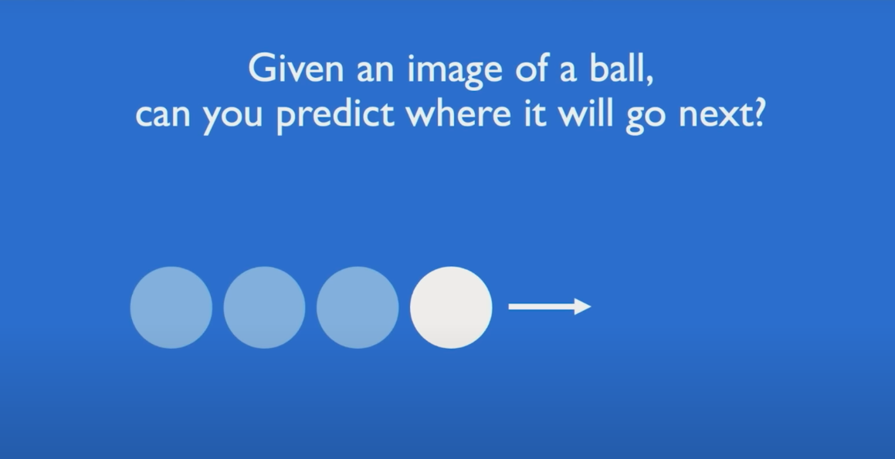
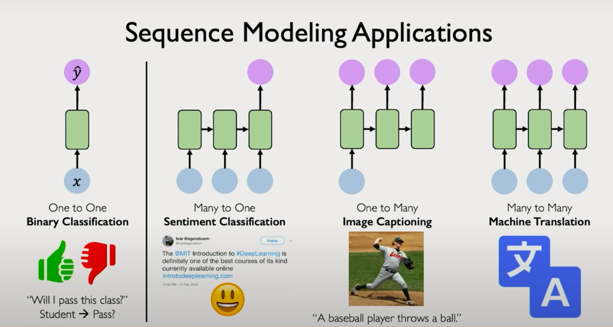
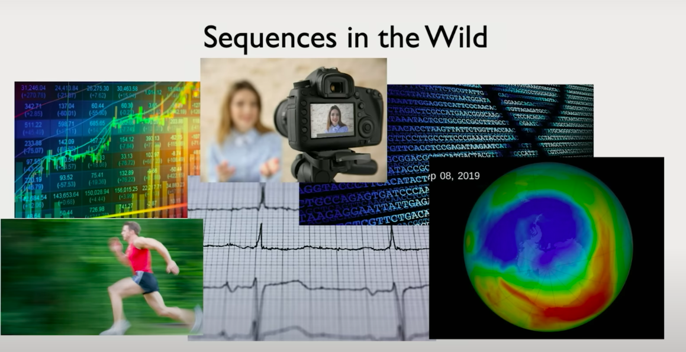
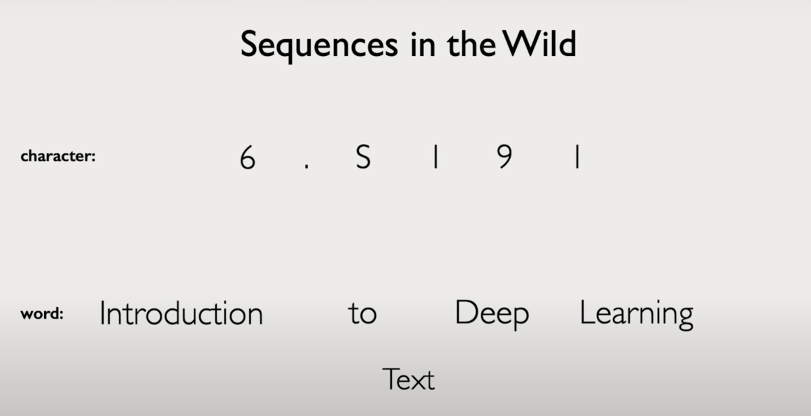
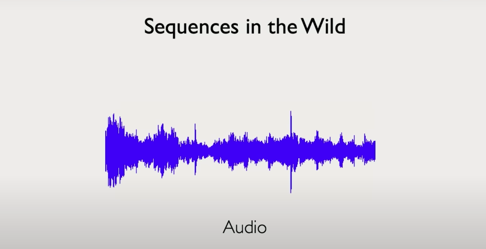

# Chapter 1: Foundations of Deep Sequence Modeling

## Why Sequence Modeling? A Motivating Example

Let’s begin with an intuitive motivation. Imagine a ball moving in 2D space. You're asked to predict its next location.  
**Case 1:**  
You only have access to the ball's current position. Any prediction you make will essentially be a guess — the problem is underdetermined.

**Case 2:**  
You're also given the ball’s prior trajectory — its historical positions. With this sequence of past states, you can now model its motion and reasonably estimate its future position.

This illustrates the crux of sequence modeling: incorporating historical context to improve predictive accuracy.

## Sequence Data in the Real World

While the example above is simple, the relevance of sequence modeling extends across diverse domains:

- **Speech and Audio:**  
  Voice signals can be decomposed into sequences of sound wave chunks over time.

- **Natural Language:**  
  Sentences are sequences of words or characters.

- **Medical Signals:**  
  ECGs and EEGs are temporal sequences of voltage measurements.

- **Finance:**  
  Stock prices and market indicators evolve as time-series data.

- **Biology:**  
  DNA and protein sequences are naturally sequential.

- **Video:**  
  Frame-by-frame temporal evolution can be modeled as sequences.

- **Weather Forecasting:**  
  Historical weather patterns provide sequential structure for future prediction.

In each case, the temporal or positional ordering of data points is essential. Ignoring that order risks discarding key patterns.

## Types of Sequence Modeling Problems

Unlike traditional classification tasks where inputs and outputs are fixed-length and often tabular, sequence modeling introduces structured and variable-length data. Let's look at some canonical problem types:

### Sequence Classification:
- **Input:** A sequence of tokens (e.g., words in a sentence)  
- **Output:** A fixed label (e.g., sentiment classification: positive vs negative)  
- **Example:** Text classification, intent recognition.

### Sequence-to-Sequence (Seq2Seq) Generation:
- **Input:** A sequence  
- **Output:** Another sequence  
- **Examples:**  
  - Translation: English → French  
  - Speech Recognition: Audio → Text  
  - Image Captioning: Visual features → Sentence

### Many-to-One:
- **Input:** A sequence  
- **Output:** A single label  
- **Example:** Predicting stock trend direction based on previous N time steps.

### One-to-Many:
- **Input:** A single state  
- **Output:** A sequence  
- **Example:** Image → Description (caption generation).

### Many-to-Many:
- **Input:** Sequence A  
- **Output:** Sequence B  
- **Example:**  
  - Video frame → Text transcript  
  - Language translation tasks

These problem types are foundational to real-world applications of NLP, speech, vision, and decision modeling systems.

## Core Challenge: Capturing Temporal Dependencies

A feedforward neural network  as discussed in the previous lecture  assumes that all input features are independent and identically distributed (i.i.d.). This assumption breaks down in sequential settings. In sequence modeling:

- Inputs are ordered.  
- Future predictions must respect and leverage past observations.  
- The same model must be applied across time steps or positions.

To handle this, we need architectures that are designed to process sequences  capable of learning representations where current predictions are functions of both present and past information.

This sets the stage for understanding Recurrent Neural Networks (RNNs), Long Short-Term Memory (LSTM) networks, and eventually, Transformers.

