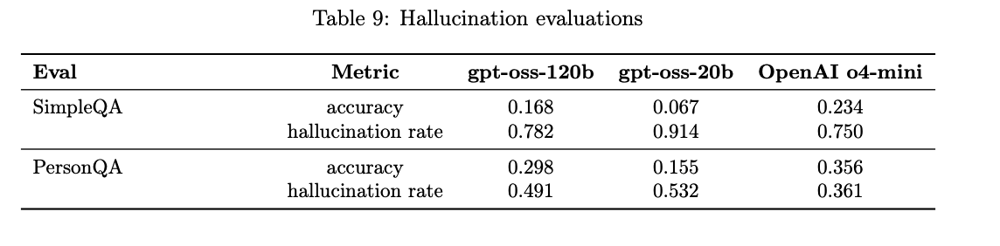
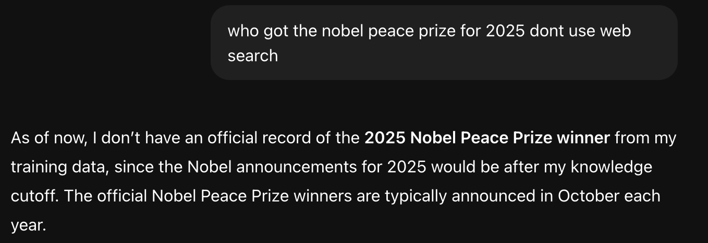
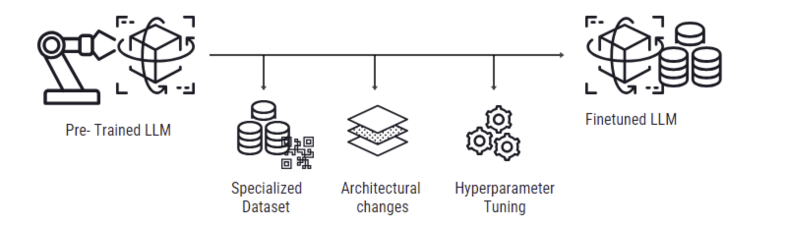
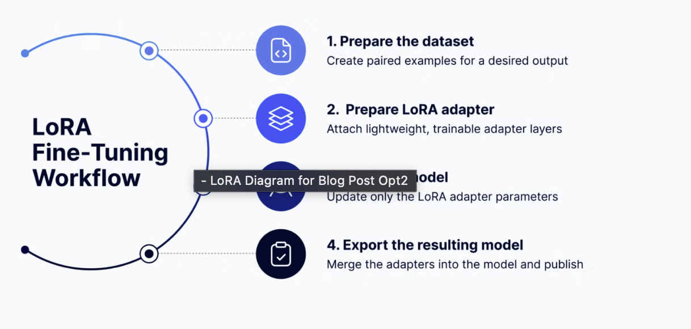
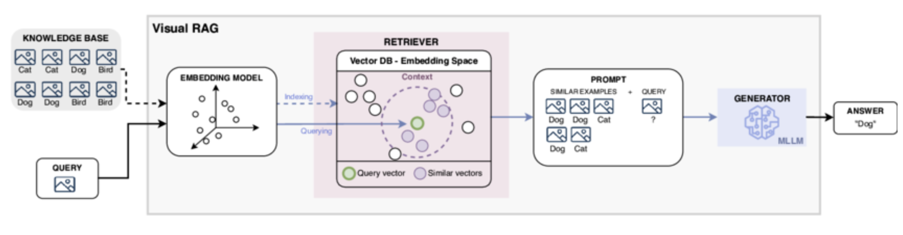
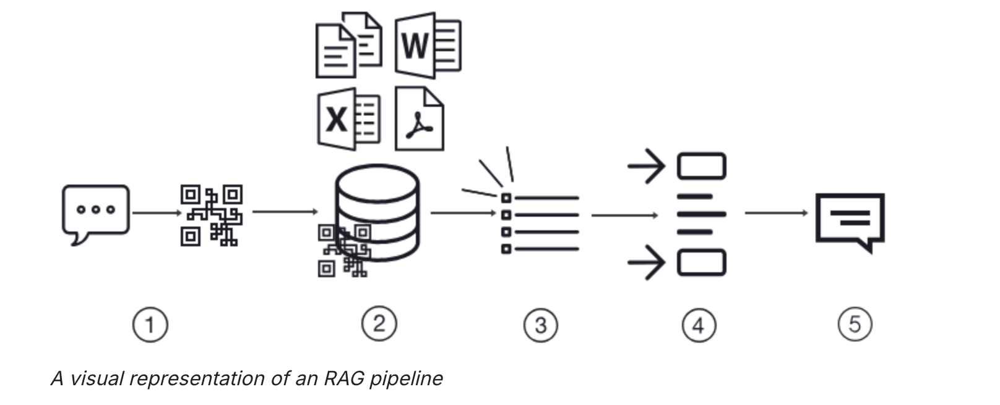
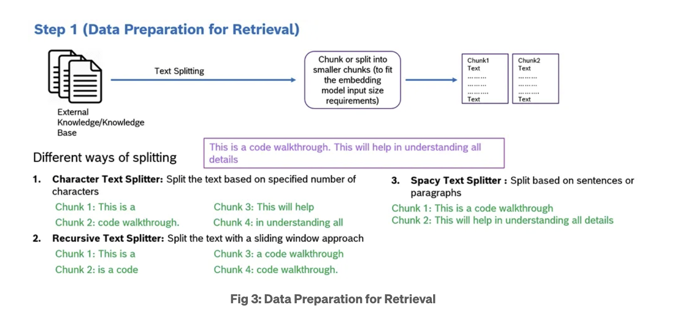
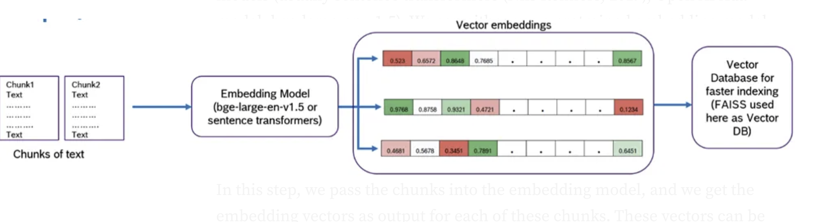
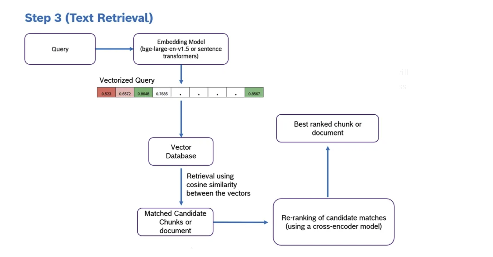

# LoRA Fine-Tuning vs RAG Agents: Two Paths to Smarter, More Truthful LLMs

## Introduction: The 2 sides of LLM adaptation

Large Language Models(LLMs) have changed how we interact with AI. They can summarize docs, write code, explain math and sometimes confidently hallucinate false facts.r

As ML engineers, we are constantly chasing one goal i.e. reduce hallucinations while improving the task-specific performance. 

The 2 main strategies dominate this space:

1. LoRA Fine tuning- teach the model new knowledge efficiently.
2. RAG(Retrieval Augmented Generation) and Agentic RAG - connect the model to reliable external data sources at inference time.

Both aim to make models more accurate and context-aware but in very different ways.

---

## Understanding Hallucinations in LLMs

Before diving in, we need to understand the problem we’re trying to solve.

Hallucination occurs when an LLM produces output that sounds plausible or pleasing but it is not factually correct.

We check for hallucinations in gpt-oss-120b and gpt-oss-20b using the following evaluations, both
of which were run without giving the models the ability to browse the internet:
• SimpleQA: A diverse dataset of four thousand fact-seeking questions with short answers
that measures model accuracy for attempted answers.
• PersonQA: A dataset of questions and publicly available facts about people that measures
the model’s accuracy on attempted answers.
We consider two metrics: accuracy (did the model answer the question correctly) and hallucination
rate (did the model answer the question incorrectly). Higher is better for accuracy and lower is
better for hallucination rate.

### Why hallucinations happen

- Knowledge gaps: The model hasn’t seen enough relevant data during training.
- Overconfidence: It “fill in the blanks” even when uncertain.
- Prompt drift: Poorly structured prompts lead to misinterpretation.
- Outdated Data: The world changes, but pretrained weights remain the same.

This is one more example where the gpt-4 has a knowledge gap.

Two types commonly appear:

- Intrinsic Hallucinations: Fabrications within the model’s internal reasoning.
- Extrinsic Hallucinations: Incorrect statements about retrieved or cited sources.

The key question:

➡️ _Should we teach the model better (LoRA), or give it access to better data (RAG)?_

---

## ⚙️ LoRA Fine-Tuning — Teaching Models Efficiently

Fine-tuning could be likened to sculpting, where a model is precisely refined, like shaping marble into a distinct figure. Initially, a model is broadly trained on a diverse dataset to understand general patterns—this is known as pre-training. Think of pre-training as laying a foundation; it equips the model with a wide range of knowledge.

Fine-tuning, then, adjusts this pre-trained model and its weights to excel in a particular task by training it further on a more focused dataset related to that specific task. From training on vast text corpora, pre-trained LLMs, such as GPT or BERT, have a broad understanding of language.

Fine-tuning adjusts these models to excel in targeted applications, from sentiment analysis to specialized conversational agents.

### Why fine-tuning

The breadth of knowledge LLMs acquire through initial training is impressive but often lacks the depth or specificity required for certain tasks. Fine-tuning addresses this by adapting the model to the nuances of a specific domain or function, enhancing its performance significantly on that task without the need to [train a new model](https://datasciencedojo.com/blog/llm-chatbot/) from scratch.

### What is LoRa?

LoRA is a parameter efficient fine- tuning technique. Instead of updating all billions of parameters of an LLM, LoRA freezes the base model and trains a few small “adapter” layers.

### **How does LoRA work?**

At a high level, LoRA works like this:

- **Freeze the base model**: The model’s original weights (its core knowledge of language) remain unchanged.
- **Add adapter layers**: Small, trainable “side modules” are inserted into specific parts of the model. These adapters learn only the new behavior or skill you want to teach.
- **Train efficiently**: During fine-tuning, only the adapter parameters are updated. The rest of the model stays static, which dramatically reduces compute and memory requirements.

Mathematically :

$W=W0+AB$

Here:

- W0 is the frozen pre-trained weight matrix
- A and B are small trainable matrix

### ⚡ Why Developers Love LoRA

- 🧠 **Retains base knowledge:** No catastrophic forgetting.
- 💾 **Lightweight:** Only a few million parameters to train instead of billions.
- 🕒 **Fast:** Fine-tune large models on a single GPU.
- 🧰 **Tooling support:** Hugging Face PEFT makes it almost plug-and-play.

### 🧠 Real-World Use Cases

- **Domain specialization:** e.g., legal, finance, or healthcare text.
- **Instruction-tuning:** Aligning tone and task behavior.
- **Custom chatbots:** Tailored brand personality or support dialogue.

### 🚧 Limitations

- Static knowledge — can’t adapt to new facts without retraining.
- Risk of overfitting if fine-tuning data is narrow.
- Doesn’t inherently reduce hallucination — just _shifts_ it to your fine-tuning domain.

---

## 🔗 RAG (Retrieval-Augmented Generation) — Grounding Models in Real Data

### What is RAG?

Retrieval-augmented generation (RAG) brings an approach to natural language processing that’s both smart and efficient. It solved many problems faced by current LLMs, and that’s why it’s the most talked about technique in the [NLP](https://datasciencedojo.com/blog/natural-language-processing-applications/) space.

**Always Up-To-Date:** RAG keeps answers fresh by accessing the latest information. RAG ensures the AI’s responses are current and correct in fields where facts and data change rapidly.

**Sticks to the Facts:** Unlike other models that might guess or make up details (a ” [hallucinations](https://datasciencedojo.com/blog/ai-hallucinations/) ” problem), RAG checks facts by referencing real data. This makes it reliable, giving you answers based on actual information.

this is the schematic representation of visual rag

RAG pipeline

## 1. Data prep

## **2. Query Initiation and Vectorization**

- Your query starts as a simple string of text. However, computers, particularly AI models, don’t understand text and its underlying meanings the same way humans do. To bridge this gap, **the RAG system converts your question into an [embedding](https://datasciencedojo.com/blog/embeddings-and-llm/), also known as a vector.**
- Why a vector, you might ask? Well, A vector is essentially a numerical representation of your query, capturing not just the words but the meaning behind them. This allows the system to search for answers based on concepts and ideas, not just matching keywords.

## **3. Searching the Vector Database**

- With your query now in vector form, the RAG system seeks answers in an up-to-date vector database. **The system looks for the vectors in this database that are closest to your query’s vector**—the semantically similar ones, meaning they share the same underlying concepts or topics.

- But what exactly is a vector database?
  - **Vector databases defined:** A vector database stores vast amounts of information from diverse sources, such as the latest research papers, news articles, and scientific discoveries. However, it doesn’t store this information in traditional formats (like tables or text documents). Instead, each piece of data is converted into a vector during the ingestion process.
  - **Why vectors?:** This conversion to vectors allows the database to represent the data’s meaning and context numerically or into a language the computer can understand and comprehend deeply, beyond surface-level keywords.
  - **Indexing:** Once information is vectorized, it’s indexed within the database. Indexing organizes the data for rapid retrieval, much like an index in a textbook, enabling you to find the information you need quickly. This process ensures that the system can efficiently locate the most relevant information vectors when it searches for matches to your query vector.

## **4.Selecting the Top ‘k’ Responses**

- From this search, **the system selects the top few matches**—let’s say the top 5. These matches are essentially pieces of information that best align with the essence of your question.
- By concentrating on the top matches, the RAG system ensures that the augmentation enriches your query with the most relevant and informative content, avoiding information overload and maintaining the response’s relevance and clarity.

## **5.Augmenting the Query**

- Next, the information from these top matches is used to augment the original query you asked the LLM. This doesn’t mean the system simply piles on data. Instead, it integrates key insights from these top matches to enrich the context for generating a response. This step is crucial because it ensures the model has a broader, more informed base from which to draw when crafting its answer.

## **6.Generating the Response**

- Now comes the final step: generating a response. With the augmented query, the model is ready to reply. It doesn’t just output the retrieved information verbatim. Instead, it synthesizes the enriched data into a coherent, natural-language answer.For your renewable energy question, the model might generate a summary highlighting the most recent and impactful breakthrough, perhaps detailing a new solar panel technology that significantly increases power output. This answer is informative, up-to-date, and directly relevant to your query.

### RAG pipeline Explore

---

LoRA vs RAG - The showdown

| Feature                   | LoRA Fine-Tuning                       | RAG / Agentic RAG                   |
| ------------------------- | -------------------------------------- | ----------------------------------- |
| **Goal**                  | Teach the model new internal knowledge | Feed external, up-to-date facts     |
| **When to use**           | Static or proprietary data domains     | Dynamic, changing knowledge         |
| **Compute cost**          | Requires training time                 | Low training, higher inference cost |
| **Hallucination control** | Limited; depends on fine-tuning data   | Better grounding via external docs  |
| **Explainability**        | Opaque; hard to cite facts             | Transparent; can show sources       |
| **Update mechanism**      | Re-train LoRA adapters                 | Update vector store instantly       |
