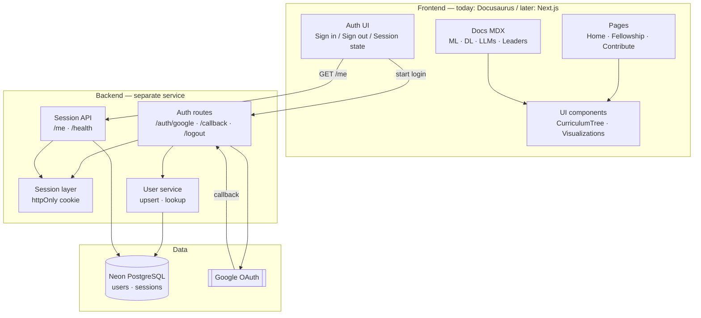
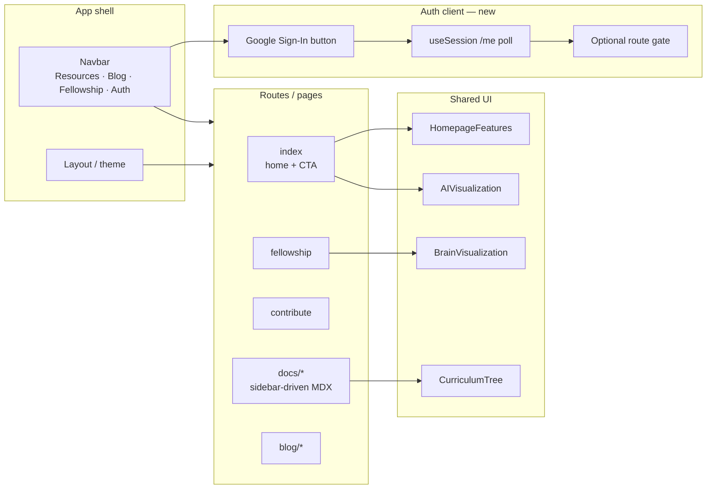
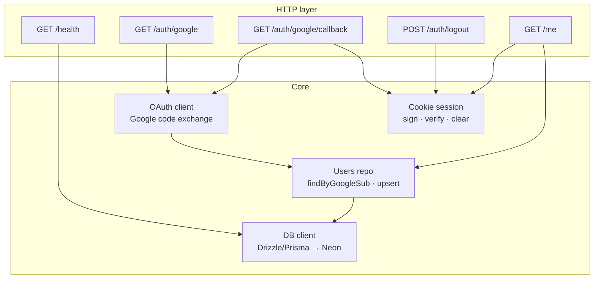
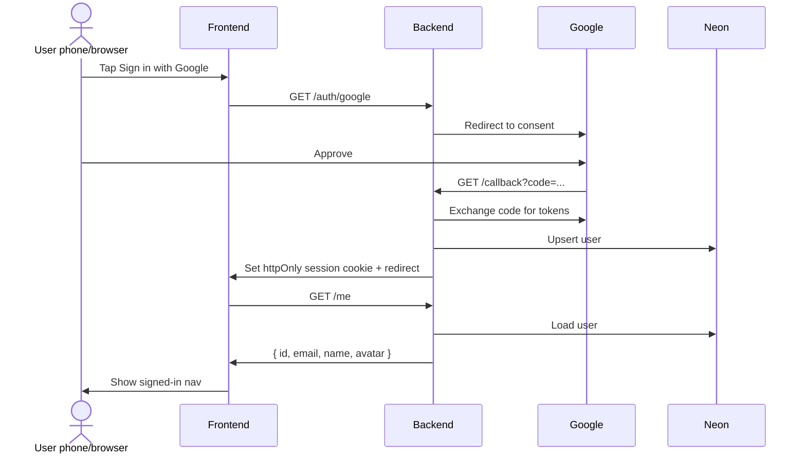
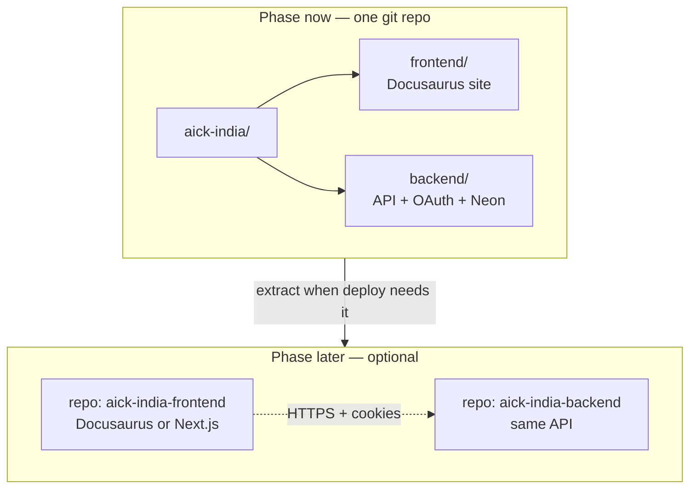

# AICK India — Component-level architecture

Open this file on GitHub (PR or `plans/` folder). Mermaid diagrams render in the mobile browser / GitHub app — no HTML preview needed.

---

## 1. Big picture (what talks to what)

---

## 2. Frontend components (current site → future Next)

**Migration note:** When you move to Next.js, keep the same boxes — swap Docusaurus routing/theme for App Router + your layout. MDX content and shared components move; the backend URLs stay.

---

## 3. Backend components (the small API)

---

## 4. Login sequence (one happy path)

---

## 5. Repo / folder shape (now → later)

---

## 6. What to look at first on your phone

| Diagram | Question it answers |
|---|---|
| §1 Big picture | Where does Google / Neon sit? |
| §2 Frontend | What UI pieces exist / get auth? |
| §3 Backend | What are the real API building blocks? |
| §4 Sequence | What happens when I tap Sign in? |
| §5 Repos | Why directory-first, repos later? |

---

## How to view on phone

1. Open the PR on GitHub → **Files changed** → this `.md` file, **or**
2. Open: `plans/aick-india-architecture.md` in the repo on github.com

GitHub renders Mermaid in Markdown on mobile. Prefer this over the `.html` plan for diagrams on a phone; keep the HTML for the longer written plan if you open it on desktop later.
